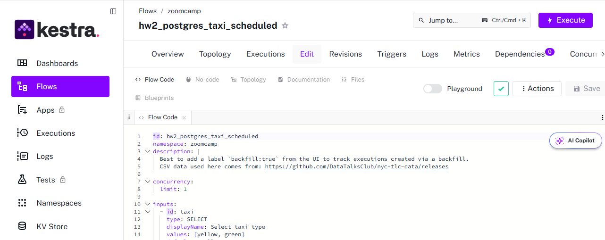
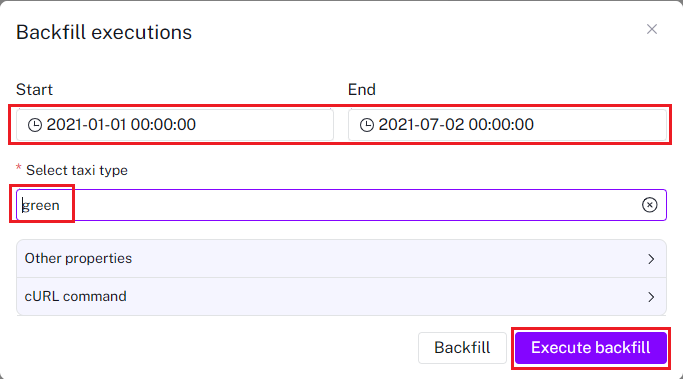
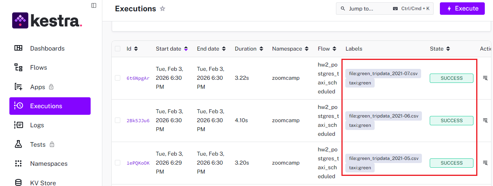
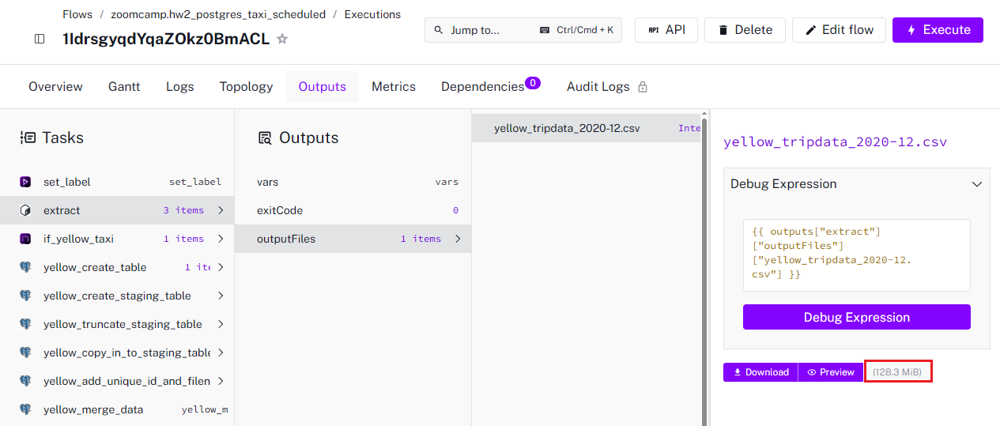
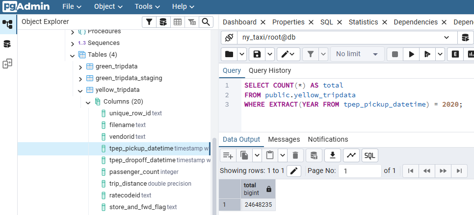
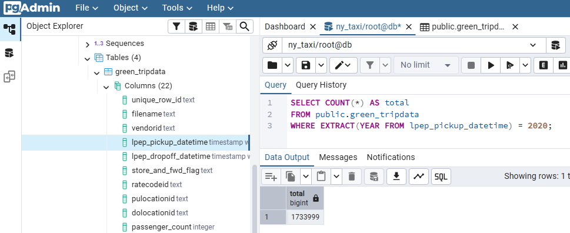
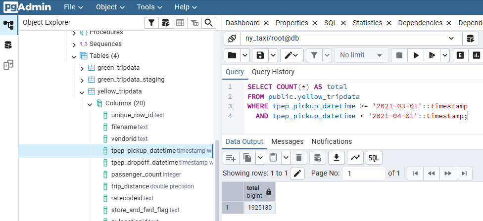

`https://raw.githubusercontent.com/DataTalksClub/data-engineering-zoomcamp/refs/heads/main/cohorts/2026/02-workflow-orchestration/homework.md`

## Module 2 Homework

For this homework, we'll be working with the _green_ taxi dataset located here:

`https://github.com/DataTalksClub/nyc-tlc-data/releases/tag/green/download`


1. Run `kestra` with the following command:

```bash
docker compose up
```

2. Create the flow from the [kestra_postgres_taxi_scheduled.yaml](kestra_postgres_taxi_scheduled.yaml) file



3. Run `Backfill executions` from 01.01.2021 till 02.07.2021 separatly for `green` and `yellow` taxi


Green taxi: 


Make sure that all data was fetched: 



### Quiz Questions

1) Within the execution for `Yellow` Taxi data for the year `2020` and month `12`: what is the uncompressed file size (i.e. the output file `yellow_tripdata_2020-12.csv` of the `extract` task)?

Because in this questions uses 2020 year, I also run `Backfill executions` from 01.01.2020 till 02.12.2020 separatly for `green` and `yellow` taxi



Ans: 128.3 Mb

2) What is the rendered value of the variable `file` when the inputs `taxi` is set to `green`, `year` is set to `2020`, and `month` is set to `04` during execution?

Ans: `green_tripdata_2020-04.csv`

3) How many rows are there for the `Yellow` Taxi data for all CSV files in the year 2020?

```sql
SELECT COUNT(*) AS total
FROM public.yellow_tripdata
WHERE EXTRACT(YEAR FROM tpep_pickup_datetime) = 2020;
```



Ans: 24,648,499

4) How many rows are there for the `Green` Taxi data for all CSV files in the year 2020?

```sql
SELECT COUNT(*) AS total
FROM public.green_tripdata
WHERE EXTRACT(YEAR FROM lpep_pickup_datetime) = 2020;
```



Ans: 1,734,051

5) How many rows are there for the `Yellow` Taxi data for the March 2021 CSV file?

```sql
SELECT COUNT(*) AS total
FROM public.yellow_tripdata
WHERE tpep_pickup_datetime >= '2021-03-01'::timestamp
  AND tpep_pickup_datetime < '2021-04-01'::timestamp;
```



Ans: 1,925,152

6) How would you configure the timezone to New York in a Schedule trigger?

```text
triggers:
  - id: daily
    type: io.kestra.plugin.core.trigger.Schedule
    cron: "@daily"
    timezone: America/New_York
```

Ans: Add a `timezone` property set to `America/New_York` in the `Schedule` trigger configuration