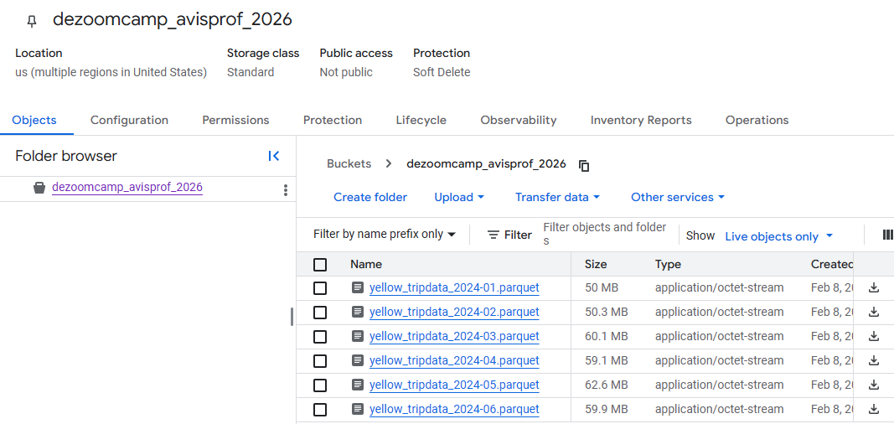
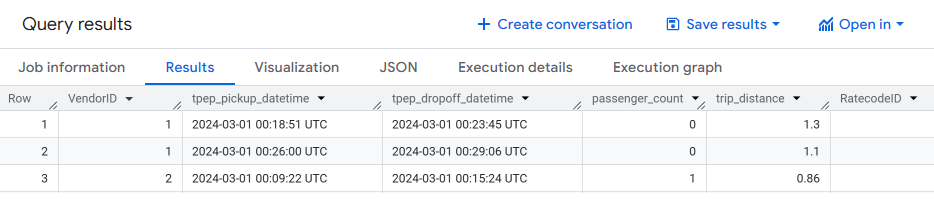
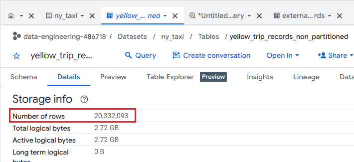
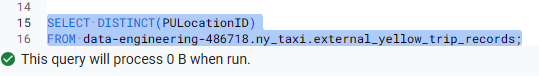
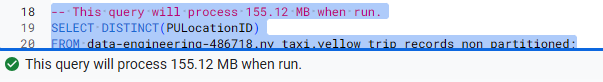
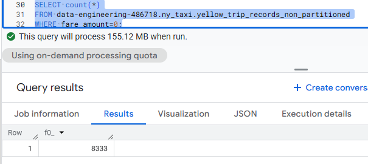
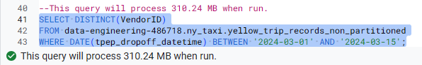
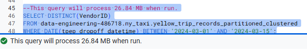

https://github.com/DataTalksClub/data-engineering-zoomcamp/blob/main/cohorts/2026/03-data-warehouse/homework.md

## Module 3 Homework: Data Warehousing & BigQuery

In this homework we'll practice working with BigQuery and Google Cloud Storage.

For this homework we will be using the Yellow Taxi Trip Records for January 2024 - June 2024 (not the entire year of data).

Parquet Files are available from the New York City Taxi Data found here:

https://www.nyc.gov/site/tlc/about/tlc-trip-record-data.page

## Loading the data

Use the [load_yellow_taxi_data.py](./load_yellow_taxi_data.py) script to load the data into your GCS bucket:

```python
python load_yellow_taxi_data.py 
```




## BigQuery Setup

In the BigQuery console create the `ny_taxi` dataset


Create an external table using the Yellow Taxi Trip Records:
```sql
-- Creating external table referring to gcs path
CREATE OR REPLACE EXTERNAL TABLE `data-engineering-486718.ny_taxi.external_yellow_trip_records`
OPTIONS (
  format = 'PARQUET',
  uris = ['gs://dezoomcamp_avisprof_2026/*.parquet']  
);
```

Check yellow trip data:
```sql
SELECT * FROM data-engineering-486718.ny_taxi.external_yellow_trip_records limit 10;
```




Create a (regular/materialized) table in BQ using the Yellow Taxi Trip Records (do not partition or cluster this table):

```sql
-- Create a non partitioned table from external table
CREATE OR REPLACE TABLE data-engineering-486718.ny_taxi.yellow_trip_records_non_partitioned AS
SELECT * FROM data-engineering-486718.ny_taxi.external_yellow_trip_records;
```

## Question 1. Counting records

What is count of records for the 2024 Yellow Taxi Data?



Ans: 20,332,093

## Question 2. Data read estimation

Write a query to count the distinct number of PULocationIDs for the entire dataset on both the tables.

External table:
```sql
-- This query will process 0 B when run.
SELECT DISTINCT(PULocationID)
FROM data-engineering-486718.ny_taxi.external_yellow_trip_records;
```



Regular table:
```sql
-- This query will process 155.12 MB when run.
SELECT DISTINCT(PULocationID)
FROM data-engineering-486718.ny_taxi.yellow_trip_records_non_partitioned;
```




What is the **estimated amount** of data that will be read when this query is executed on the External Table and the Table?

Ans: 0 MB for the External Table and 155.12 MB for the Materialized Table

## Question 3. Understanding columnar storage

Write a query to retrieve the PULocationID from the table (not the external table) in BigQuery
```sql
--This query will process 155.12 MB when run.
SELECT PULocationID
FROM data-engineering-486718.ny_taxi.yellow_trip_records_non_partitioned;
```

Now write a query to retrieve the PULocationID and DOLocationID on the same table.
```sql
--This query will process 310.24 MB when run.
SELECT PULocationID, DOLocationID
FROM data-engineering-486718.ny_taxi.yellow_trip_records_non_partitioned;
```

Why are the estimated number of Bytes different?

- BigQuery is a columnar database, and it only scans the specific columns requested in the query. Querying two columns (PULocationID, DOLocationID) requires reading more data than querying one column (PULocationID), leading to a higher estimated number of bytes processed.

## Question 4. Counting zero fare trips

How many records have a fare_amount of 0?

```sql
SELECT count(*)
FROM data-engineering-486718.ny_taxi.yellow_trip_records_non_partitioned
WHERE fare_amount=0;
```



Ans: 8333

## Question 5. Partitioning and clustering

What is the best strategy to make an optimized table in Big Query if your query will always filter based on tpep_dropoff_datetime and order the results by VendorID 

Ans: Partition by tpep_dropoff_datetime and Cluster on VendorID

Create a new table with this strategy:
```sql
CREATE OR REPLACE TABLE data-engineering-486718.ny_taxi.yellow_trip_records_partitioned_clustered
PARTITION BY DATE(tpep_dropoff_datetime)
CLUSTER BY VendorID
AS
SELECT * FROM data-engineering-486718.ny_taxi.yellow_trip_records_non_partitioned;
```


## Question 6. Partition benefits

Write a query to retrieve the distinct VendorIDs between tpep_dropoff_datetime
2024-03-01 and 2024-03-15 (inclusive)

Use the materialized table you created earlier in your from clause and note the estimated bytes.
```sql
--This query will process 310.24 MB when run.
SELECT DISTINCT(VendorID)
FROM data-engineering-486718.ny_taxi.yellow_trip_records_non_partitioned
WHERE DATE(tpep_dropoff_datetime) BETWEEN '2024-03-01' AND '2024-03-15';
```



Now change the table in the from clause to the partitioned table you created for question 5 and note the estimated bytes processed. What are these values? 
```sql
--This query will process 26.84 MB when run.
SELECT DISTINCT(VendorID)
FROM data-engineering-486718.ny_taxi.yellow_trip_records_partitioned_clustered
WHERE DATE(tpep_dropoff_datetime) BETWEEN '2024-03-01' AND '2024-03-15';
```




Ans: 310.24 MB for non-partitioned table and 26.84 MB for the partitioned table

## Question 7. External table storage

Where is the data stored in the External Table you created?

Ans: GCP Bucket

## Question 8. Clustering best practices

It is best practice in Big Query to always cluster your data

Ans: False

## Question 9. Understanding table scans

No Points: Write a `SELECT count(*)` query FROM the materialized table you created. How many bytes does it estimate will be read? Why?


BigQuery estimates 0 bytes will be read.


BigQuery maintains internal metadata statistics on every table, including exact row counts updated periodically (usually within minutes of changes).
​

For COUNT(*), the engine uses this metadata directly, avoiding any data scan-no slots consumed, instant execution.
​

Partitioning and clustering don't affect COUNT(*) since no filter or grouping prunes data; metadata suffices regardless.
​

In the query editor, the slot usage shows "0B scanned" before running