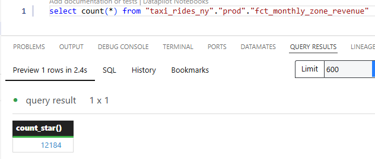
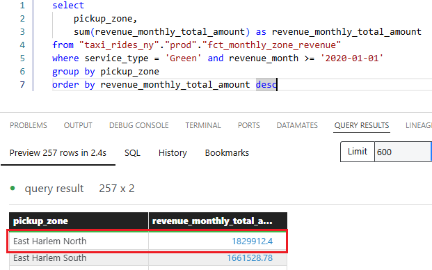
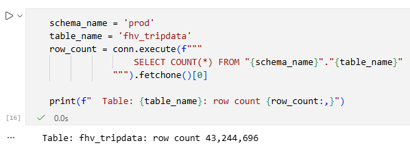

https://github.com/DataTalksClub/data-engineering-zoomcamp/blob/main/cohorts/2026/04-analytics-engineering/homework.md

# Module 4 Homework: Analytics Engineering with dbt

In this homework, we'll use the dbt project in `04-analytics-engineering/taxi_rides_ny/` to transform NYC taxi data and answer questions by querying the models.

Load the Green and Yellow taxi data for 2019-2020 into your warehouse

```bash
python ingest.py
```

## Step 1: Install DuckDB

```bash
curl https://install.duckdb.org | sh
```

## Step 2: Install dbt

```bash
pip install dbt-duckdb
```

## Step 3: Configure dbt Profile

### Create or Update `~/.dbt/profiles.yml`

The dbt profile tells dbt how to connect to your database. Create or update the file `~/.dbt/profiles.yml` with the following content:

```yaml
taxi_rides_ny:
  target: dev
  outputs:
    # DuckDB Development profile
    dev:
      type: duckdb
      path: taxi_rides_ny.duckdb
      schema: dev
      threads: 1
      extensions:
        - parquet
      settings:
        memory_limit: '2GB'
        preserve_insertion_order: false

    # DuckDB Production profile
    prod:
      type: duckdb
      path: taxi_rides_ny.duckdb
      schema: prod
      threads: 1
      extensions:
        - parquet
      settings:
        memory_limit: '2GB'
        preserve_insertion_order: false

### Step 4

Run `dbt build --target prod` to create all models and run tests

### Question 1. dbt Lineage and Execution

Given a dbt project with the following structure:

```
models/
├── staging/
│   ├── stg_green_tripdata.sql
│   └── stg_yellow_tripdata.sql
└── intermediate/
    └── int_trips_unioned.sql (depends on stg_green_tripdata & stg_yellow_tripdata)

If you run `dbt run --select int_trips_unioned`, what models will be built?

Ans: - `stg_green_tripdata`, `stg_yellow_tripdata`, and `int_trips_unioned` (upstream dependencies)

### Question 2. dbt Tests

You've configured a generic test like this in your `schema.yml`:

```yaml
columns:
  - name: payment_type
    data_tests:
      - accepted_values:
          arguments: 
            values: [1, 2, 3, 4, 5]
            quote: false
```

Your model `fct_trips` has been running successfully for months. A new value `6` now appears in the source data.

What happens when you run `dbt test --select fct_trips`?

Ans: dbt will fail the test, returning a non-zero exit code.

### Question 3. Counting Records in `fct_monthly_zone_revenue`

After running your dbt project, query the `fct_monthly_zone_revenue` model.

What is the count of records in the `fct_monthly_zone_revenue` model?

```sql
select count(*) from "taxi_rides_ny"."prod"."fct_monthly_zone_revenue"
```



Ans: 12184

### Question 4. Best Performing Zone for Green Taxis (2020)

Using the `fct_monthly_zone_revenue` table, find the pickup zone with the **highest total revenue** (`revenue_monthly_total_amount`) for **Green** taxi trips in 2020.

```sql
select 
    pickup_zone,
    sum(revenue_monthly_total_amount) as revenue_monthly_total_amount
from "taxi_rides_ny"."prod"."fct_monthly_zone_revenue"
where service_type = 'Green' and revenue_month >= '2020-01-01'
group by pickup_zone
order by revenue_monthly_total_amount desc
```

Which zone had the highest revenue?



Ans: East Harlem North

### Question 5. Green Taxi Trip Counts (October 2019)

Using the `fct_monthly_zone_revenue` table, what is the **total number of trips** (`total_monthly_trips`) for Green taxis in October 2019?

```sql
select 
    sum(total_monthly_trips)
from "taxi_rides_ny"."prod"."fct_monthly_zone_revenue"
where service_type = 'Green' and revenue_month = '2019-10-01'
```
Ans: 384,624

### Question 6. Build a Staging Model for FHV Data

Create a staging model for the **For-Hire Vehicle (FHV)** trip data for 2019.

1. Load the [FHV trip data for 2019](https://github.com/DataTalksClub/nyc-tlc-data/releases/tag/fhv) into your data warehouse

```bash
python ingest_fhv.py
```

2. Create a staging model `stg_fhv_tripdata` with these requirements:
   - Filter out records where `dispatching_base_num IS NULL`
   - Rename fields to match your project's naming conventions (e.g., `PUlocationID` → `pickup_location_id`)

What is the count of records in `stg_fhv_tripdata`?

```sql
with source as (
    select * from {{ source('raw', 'fhv_tripdata') }}
),

renamed as (
    select
        -- identifiers
        cast(pulocationid as integer) as pickup_location_id,
        cast(dolocationid as integer) as dropoff_location_id,

        -- timestamps
        cast(pickup_datetime as timestamp) as pickup_datetime,  
        cast(dropoff_datetime as timestamp) as dropoff_datetime,

        -- trip info
        cast(sr_flag as string) as store_and_fwd_flag,
        cast(dispatching_base_num as string) as dispatching_base_num,
        cast(affiliated_base_number as string) as affiliated_base_number

    from source
    where dispatching_base_num is not null
)

select count(*) from renamed
```



Ans: - 43,244,693